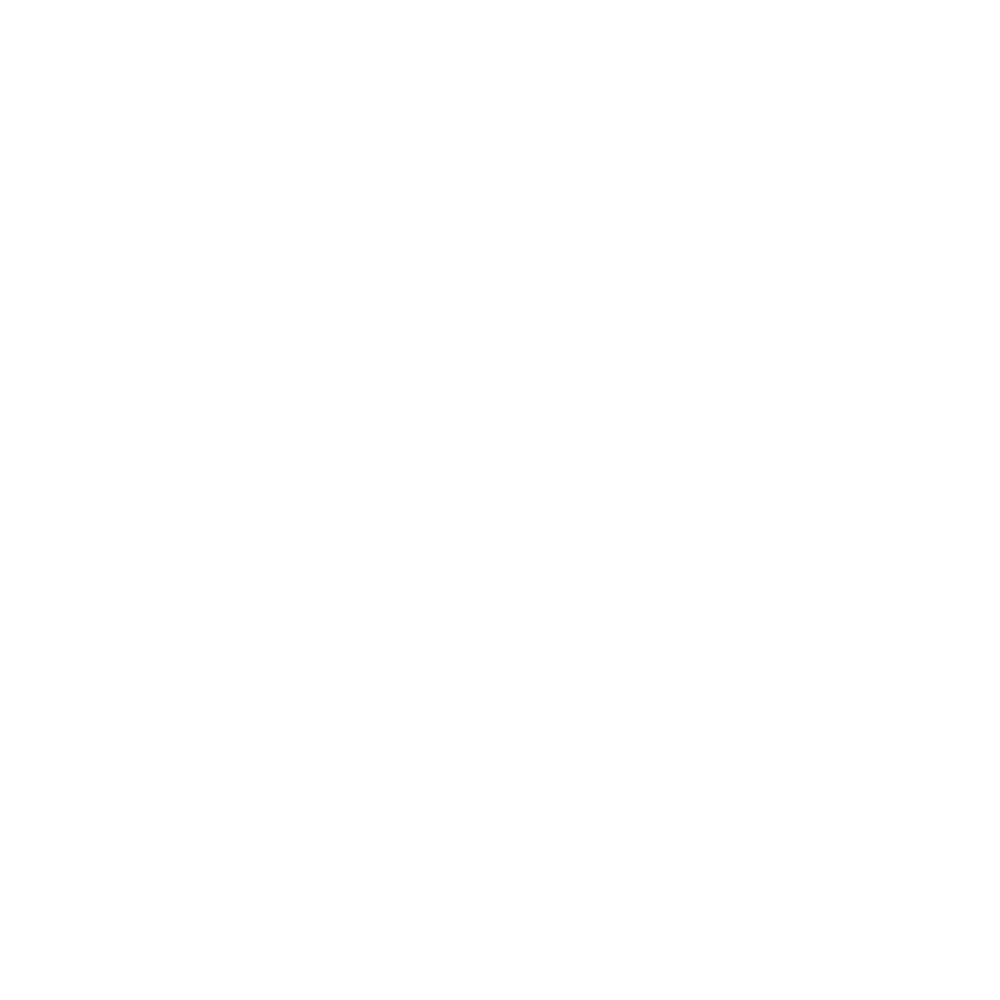

<p align="center">
  
</p>

<h1 align="center">Promter</h1>

<p align="center">
  <strong>Generate complete websites — powered by a modular prompt library.</strong>
</p>

<p align="center">
  <a href="https://promter.dev">Website</a> ·
  <a href="https://promter.dev/resources">Prompt Library</a> ·
  <a href="https://promter.dev/templates">Templates</a> ·
  <a href="https://promter.dev/api/prompts.json">API</a>
</p>

<p align="center">
  <a href="LICENSE"></a>
  
  
  
</p>

---

## What is Promter?

Promter is an open-source **prompt library and generator** for building production-ready websites. Instead of writing long, repetitive prompts from scratch, you pick a template or combine modular prompt modules — and get a battle-tested, multi-part prompt that covers UI style, layout, animations, 3D effects, and more.

**The problem:** Generating a full website requires detailed prompts covering design, layout, animations, responsiveness, and accessibility. Writing these from scratch every time is repetitive and inconsistent.

**The solution:** 50+ modular prompt files organized by category that can be combined into 27 preset templates — complete recipes for generating specific types of websites.

### Try it now at [promter.dev](https://promter.dev)

---

## Features

- **50+ Prompt Modules** — UI styles, layouts, animations, and 3D effects
- **27 Website Templates** — SaaS, e-commerce, portfolios, dashboards, and more
- **Prompt Builder** — Describe what you want, get a tailored prompt in seconds
- **Randomized Variations** — Every generation picks different module combinations
- **Public JSON API** — Fetch all prompts from any bot or script
- **Works Everywhere** — ChatGPT, Claude, Cursor, Copilot, Windsurf, and any AI assistant
- **100% Free & Open Source** — MIT licensed, no signup required

---

## Quick Start

### Option 1: Use the website

1. Go to [promter.dev](https://promter.dev)
2. Describe your website in the prompt builder
3. Copy the generated prompt
4. Paste into any AI coding assistant

### Option 2: Use the CLI

```bash
# Clone the repo
git clone https://github.com/edensitko/Promter.git
cd Promter

# Install dependencies
npm install

# Generate a prompt
npx generate-site startup-landing --output prompt.md

# List all presets
npx generate-site --list
```

### Option 3: Use the API

All prompts are available as public JSON — no API key needed:

```python
import requests

# Fetch all prompt modules
prompts = requests.get("https://promter.dev/api/prompts.json").json()

# Fetch all template configs
presets = requests.get("https://promter.dev/api/presets.json").json()

# Get a specific prompt
modern_ui = prompts["prompts"]["ui/modern-ui.md"]
```

```bash
# Or with curl
curl https://promter.dev/api/prompts.json
curl https://promter.dev/api/presets.json
```

---

## Prompt Categories

| Category | Count | Description |
|----------|-------|-------------|
| **UI Styles** | 15+ | Glassmorphism, brutalist, minimal, futuristic, dark, retro, and more |
| **Layouts** | 15+ | Landing pages, dashboards, e-commerce, portfolios, blogs, SaaS |
| **Animations** | 13+ | Scroll reveals, hover effects, page transitions, loading states |
| **3D Effects** | 10+ | Three.js heroes, product viewers, 3D cards, particle systems |

## Templates

| Template | Category | Difficulty |
|----------|----------|------------|
| Startup Landing | Landing | Beginner |
| SaaS Landing | Landing | Intermediate |
| E-commerce Modern | E-commerce | Intermediate |
| AI Dashboard | Dashboard | Advanced |
| Developer Portfolio | Portfolio | Beginner |
| Crypto Dashboard | Dashboard | Advanced |
| Photography Portfolio | Portfolio | Beginner |
| Gaming Website | Landing | Advanced |
| Restaurant Website | Landing | Beginner |
| NFT Marketplace | E-commerce | Advanced |
| ... and 17 more | | |

See all templates at [promter.dev/templates](https://promter.dev/templates)

---

## Repository Structure

```
Promter/
├── prompts/                    # Modular prompt files
│   ├── ui/                     # UI style prompts (15+)
│   ├── layouts/                # Layout prompts (15+)
│   ├── animations/             # Animation prompts (13+)
│   └── 3d/                     # 3D effect prompts (10+)
├── presets/                    # Template YAML configs (27)
├── promter-website/            # Next.js website (promter.dev)
│   ├── src/
│   ├── public/
│   │   └── api/                # Public JSON endpoints
│   └── scripts/
├── cli/                        # CLI tool
└── examples/                   # Example outputs
```

---

## Use with AI Code Editors

| Editor | How to use |
|--------|-----------|
| **Cursor** | Save as `.cursor/rules/website.md` or add to Settings → Rules |
| **Claude Code** | Save as `CLAUDE.md` in your project root |
| **Windsurf** | Add to `.windsurfrules` |
| **Copilot** | Add to `.github/copilot-instructions.md` |
| **Any AI Chat** | Copy and paste the prompt directly |

---

## Bot & API Integration

Build your own website generator using our public endpoints:

```
GET https://promter.dev/api/prompts.json   # All prompt MD files
GET https://promter.dev/api/presets.json    # All template configs
```

No authentication. No rate limits. Static JSON updated on every deploy.

Use cases:
- Claude / ChatGPT bot on EC2
- CI/CD pipeline scaffolding
- Discord / Slack bot commands
- Custom autonomous agents

---

## Contributing

Contributions are welcome! Here's how you can help:

- **Add new prompts** — Create prompt files for new UI styles, layouts, animations, or 3D effects
- **Add new templates** — Combine existing prompts into new website recipes
- **Improve existing prompts** — Make them more detailed, accurate, or useful
- **Improve the website** — UI improvements, new features, bug fixes
- **Add examples** — Show what different templates generate

```bash
# Development
cd promter-website
npm install
npm run dev    # Starts at localhost:3000
```

Please open an issue first to discuss major changes.

---

## License

MIT License. See [LICENSE](LICENSE) for details.

---

<p align="center">
  <a href="https://promter.dev"><strong>promter.dev</strong></a> — 50+ prompts · 27 templates · Infinite variations
</p>
